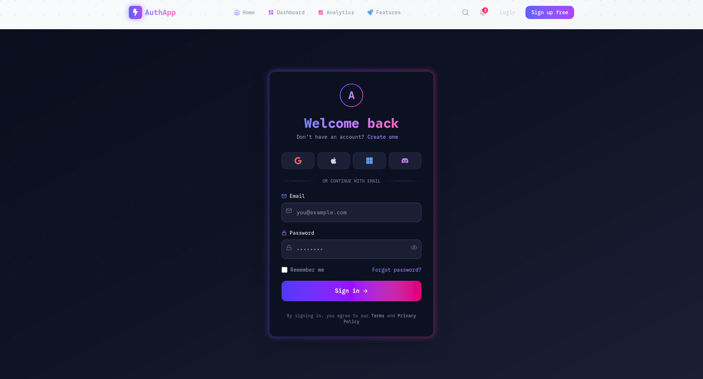
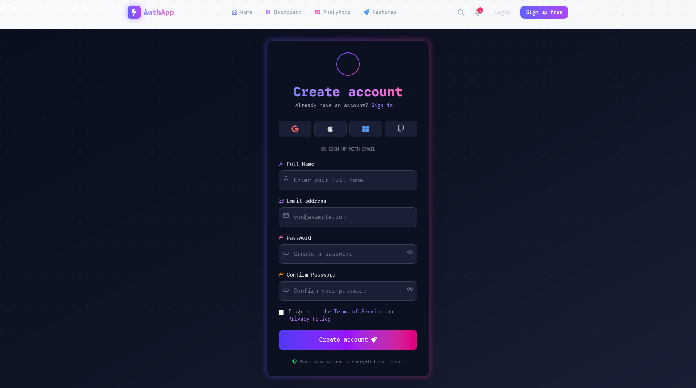
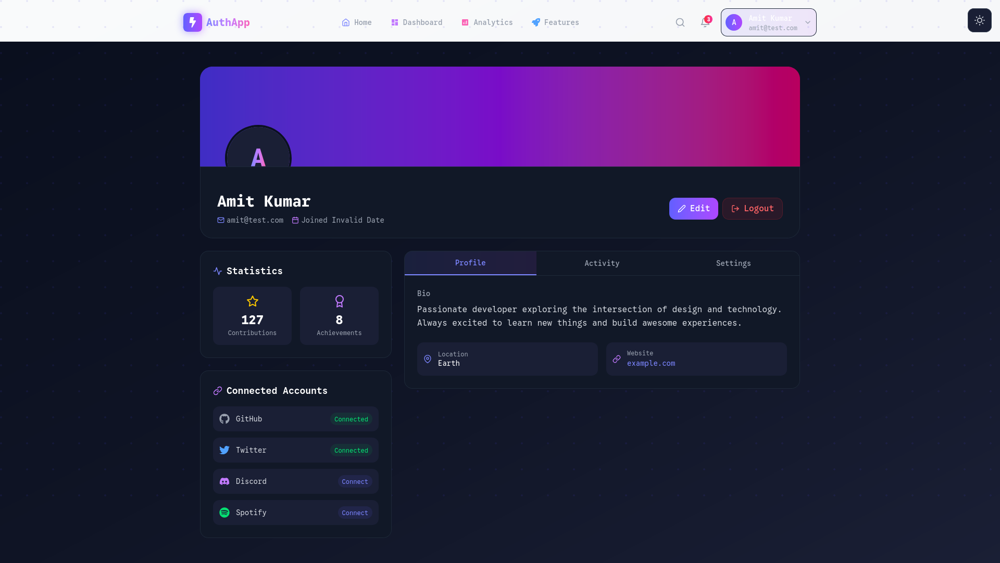

# 🚀 DevOps Auth App

A **production-style full-stack authentication system** built with modern technologies and deployed using **DevOps best practices**, including **Kubernetes Ingress and HTTPS (cert-manager)**.

---


---

## 🌍 Live Demo

👉 https://devops-auth-app.vercel.app

---

## 🌟 Overview

This project demonstrates how to build, containerize, secure, and orchestrate a full-stack application using:

* ⚛️ React (Vite)
* 🟢 Node.js + Express
* 🍃 MongoDB Atlas
* 🐳 Docker & Docker Compose
* ☸️ Kubernetes (Minikube)
* 🌐 Ingress (Nginx)
* 🔐 HTTPS with cert-manager (Let's Encrypt)

---

## 🎯 Key Highlights

* 🔐 Authentication system (Login / Register / Logout)
* 🍪 Cookie-based authentication
* 🌍 REST API integration
* 🐳 Fully Dockerized application
* ⚙️ Multi-container orchestration (Docker Compose)
* ☸️ Kubernetes deployment (Deployment + Service)
* 🌐 Ingress routing (`/` → frontend, `/api` → backend)
* 🔐 HTTPS enabled using cert-manager + Let's Encrypt
* 🔥 Real-world debugging (CORS, ENV, networking)

---

## 🛠️ Tech Stack

* Frontend: React (Vite)
* Backend: Node.js, Express
* Database: MongoDB Atlas
* DevOps: Docker, Docker Compose, Kubernetes
* Networking: Nginx Ingress
* Security: HTTPS (cert-manager)

---

## 🧱 Architecture

```text
User (Browser)
      ↓
HTTPS (TLS via cert-manager)
      ↓
Ingress (Nginx)
      ↓
Frontend (React + Vite)
      ↓
Backend (Node.js / Express)
      ↓
MongoDB Atlas
```

---

## 📸 UI Screenshots

### 🔐 Login Page



### 📝 Register Page



### 📊 Dashboard



---

## 🎥 Demo


---

## 📁 Project Structure

```text
devops-auth-app/
│
├── frontend/              # React (Vite)
├── backend/               # Node.js API
│
├── docker-compose.yml     # Multi-container setup
│
├── k8s/
│   ├── backend-deployment.yaml
│   ├── backend-service.yaml
│   ├── frontend-deployment.yaml
│   ├── frontend-service.yaml
│   ├── ingress.yaml
│   ├── cluster-issuer.yaml   # HTTPS (cert-manager)
│   └── backend-secret.yaml
│
└── README.md
```

---

## ⚙️ Environment Variables

### Backend (.env / .env.docker)

```env
NODE_ENV=development
PORT=3000
MONGO_URL=your_mongodb_atlas_url
JWT_SECRET=your_secret
```

---

### Frontend (.env.production)

```env
VITE_API_URL=/api
```

---

## 🐳 Docker Setup

### Build Images

```bash
docker build -t auth-backend ./backend
docker build -t auth-frontend ./frontend
```

---

### Run Containers

```bash
docker run -p 3000:3000 --env-file .env.docker auth-backend
docker run -p 3001:80 auth-frontend
```

---

## 🐳 Docker Compose

```bash
docker compose up --build
```

---

## ☸️ Kubernetes Setup

### Apply All Resources

```bash
kubectl apply -f k8s/
```

---

### Verify

```bash
kubectl get pods
kubectl get services
kubectl get ingress
```

---

## 🌐 Ingress Routing

```text
http://myapp.com        → Frontend
http://myapp.com/api    → Backend
```

---

## 🔐 HTTPS Setup (cert-manager)

* Installed **cert-manager**
* Created **ClusterIssuer (Let's Encrypt)**
* Configured TLS in Ingress

### ClusterIssuer Example

```yaml
apiVersion: cert-manager.io/v1
kind: ClusterIssuer
metadata:
  name: letsencrypt-prod
spec:
  acme:
    email: your-email@gmail.com
    server: https://acme-v02.api.letsencrypt.org/directory
    privateKeySecretRef:
      name: letsencrypt-prod
    solvers:
      - http01:
          ingress:
            class: nginx
```

---

## 🔧 Local Domain Setup

Edit `/etc/hosts`:

```text
<MINIKUBE_IP> myapp.com
```

---

## 🧠 Key Learnings

* 🔑 Build-time vs runtime environment variables (Vite vs Node)
* 🌐 Handling CORS in distributed systems
* 🐳 Docker networking and container communication
* ☸️ Kubernetes concepts (Pod, Service, Ingress)
* 🔐 TLS/HTTPS using cert-manager
* 🔥 Debugging real production issues

---

## 🚧 Challenges Solved

* ❌ CORS errors across containers and Kubernetes
* ❌ Environment variables not injected during build
* ❌ Incorrect API routing (`localhost` vs service)
* ❌ DNS and Ingress routing issues
* ❌ HTTPS certificate configuration

---

## 🧠 Interview Talking Points

* Built a full-stack authentication system using React and Node.js
* Containerized the application using Docker
* Orchestrated services using Docker Compose
* Deployed on Kubernetes using Deployments and Services
* Configured Ingress for routing traffic
* Implemented HTTPS using cert-manager and Let's Encrypt
* Solved real-world issues like CORS and environment variables

---

## 🚀 Future Improvements

* 🌍 Deploy to Render / Vercel
* 🔁 CI/CD pipeline (GitHub Actions)
* 📊 Monitoring (Prometheus + Grafana)
* ⚡ Horizontal Pod Autoscaling (HPA)

---

## 💼 Why This Project Matters

This project demonstrates:

* ✅ Full-stack development
* ✅ DevOps fundamentals
* ✅ Containerization & orchestration
* ✅ Kubernetes networking
* ✅ Secure production-ready architecture

---

## 👨‍💻 Author

**Amit**

---

## ⭐ If you like this project

Give it a ⭐ on GitHub!
